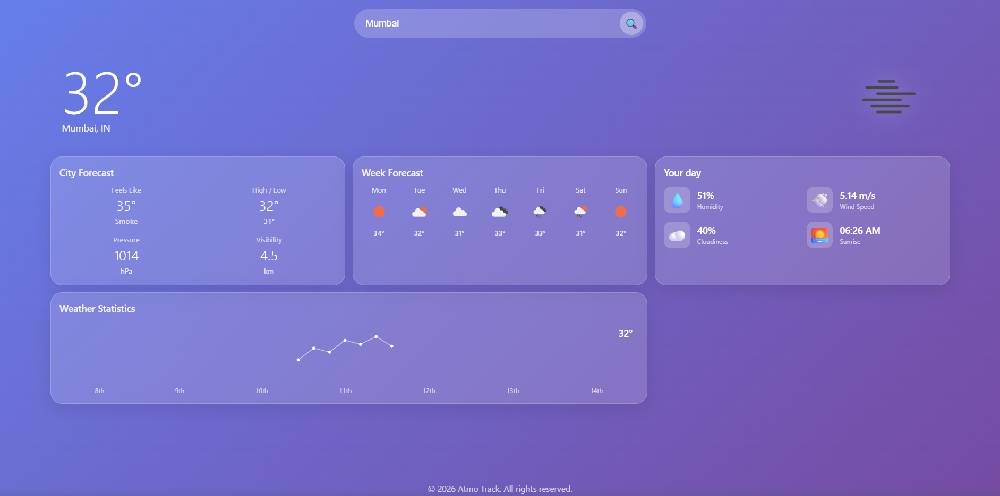

# 🌤️ Atmo Track - Modern Weather App
 
A beautiful, responsive weather application built with React and Node.js, featuring time-based dynamic backgrounds and glassmorphism design.
 

 
## ✨ Features
 
- 📱 **Fully Responsive** - Works perfectly on desktop, tablet, and mobile
- 🌈 **Modern UI** - Glassmorphism design with smooth animations
- 🌍 **Real-time Weather** - Powered by OpenWeatherMap API
- 📊 **Weather Statistics** - Humidity, wind speed, pressure, visibility, and more
- 📅 **7-Day Forecast** - Week-ahead weather predictions
- 🎯 **User-Friendly** - Clean interface with intuitive navigation
 
## 🚀 Quick Start
 
### Prerequisites
 
- Node.js (v14 or higher)
- npm or yarn
- OpenWeatherMap API key (free at https://openweathermap.org/api)
 
### Installation
 
1. **Clone the repository**
   ```bash
   git clone https://github.com/yourusername/atmo-track.git
   cd atmo-track
   ```
 
2. **Install dependencies**
   ```bash
   npm install
   ```
 
3. **Set up environment variables**
   ```bash
   cp .env.example .env
   ```
   
   Edit `.env` and add your OpenWeatherMap API key:
   ```env
   API_KEY=your_api_key_here
   PORT=5000
   VITE_API_URL=http://localhost:5000
   ```
 
4. **Run the backend server**
   ```bash
   npm start
   ```
 
5. **Run the frontend (in another terminal)**
   ```bash
   npm run dev
   ```
 
6. **Open your browser**
   - Frontend: http://localhost:5173
   - Backend: http://localhost:5000
 
## 📦 Tech Stack
 
### Frontend
- React 18
- Axios for API calls
- CSS3 with Glassmorphism effects
- Vite for build tooling
 
### Backend
- Node.js
- Express.js
- node-fetch for API requests
- CORS for cross-origin requests

## 📝 License
 
This project is open source and available under the [MIT License](LICENSE).
 
## 🙏 Acknowledgments
 
- Weather data provided by [OpenWeatherMap](https://openweathermap.org/)
- Icons and design inspired by modern weather apps
- Built with ❤️ using React and Node.js